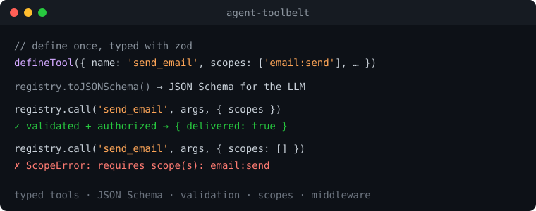

# agent-toolbelt

**Um registo de ferramentas minúsculo e agnóstico de framework para agentes LLM.** Define
ferramentas tipadas uma vez com [zod](https://zod.dev), exporta o **JSON Schema para
function/tool calling**, e executa chamadas **validadas e verificadas por scope** através
de middleware componível. Não precisa de framework de agentes — usa o teu próprio loop.

🌍 [English](README.md) · **[Português](README.pt.md)** · 📚 [Documentação](docs/README.md)

<p align="center"></p>

[](https://github.com/marcelogdomingues/agent-toolbelt/actions/workflows/ci.yml)
[](https://www.npmjs.com/package/agent-toolbelt)
[](LICENSE)

## Porquê

Todos os projetos de agentes reconstroem a mesma canalização: definir uma ferramenta,
gerar o JSON Schema para o modelo, validar os argumentos que o modelo devolve, e
executá-la — com logging e autorização por cima. O agent-toolbelt é exatamente essa
canalização, e nada mais, por isso encaixa em qualquer loop de modelo (Anthropic, estilo
OpenAI, local).

## Instalação

```bash
npm install agent-toolbelt zod
```

## Começar rápido

```ts
import { z } from 'zod';
import { defineTool, ToolRegistry, requireScopes, logging } from 'agent-toolbelt';

const getWeather = defineTool({
  name: 'get_weather',
  description: 'Get the current weather for a city.',
  input: z.object({ city: z.string() }),
  handler: ({ city }) => ({ city, tempC: 21 }),
});

const registry = new ToolRegistry()
  .register(getWeather)
  .use(logging())
  .use(requireScopes((meta) => (meta.scopes as string[]) ?? []));

// 1. Entrega isto ao teu modelo para tool/function calling:
const schema = registry.toJSONSchema();

// 2. Executa o que o modelo pede — os argumentos são validados primeiro:
const result = await registry.call('get_weather', { city: 'Lisbon' });
```

## Funcionalidades

- **Ferramentas tipadas** — `defineTool` infere o input do handler a partir do schema zod.
- **Export de JSON Schema** — `registry.toJSONSchema()` para qualquer API de function calling.
- **Validação em runtime** — argumentos inválidos lançam `ToolValidationError`, nunca chegam ao handler.
- **Middleware** — `logging()`, `requireScopes()`, ou o teu próprio middleware em cebola.
- **Scopes** — declara `scopes` por ferramenta; combina com
  [agent-passport](https://github.com/marcelogdomingues/agent-passport).
- **Minúsculo** — uma pequena dependência (zod).

## Erros

- `UnknownToolError` — não existe ferramenta com esse nome.
- `ToolValidationError` — argumentos falharam o schema zod (`.issues` para detalhes).
- `ScopeError` — o chamador não tem um scope necessário.

## Licença

MIT © Marcelo Domingues
