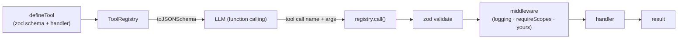

# Architecture

agent-toolbelt is the tool layer between your model and your code. A tool is defined once with
zod; the registry exports JSON Schema for the model and executes validated calls through
middleware.

## Module map

| Module | Responsibility |
| --- | --- |
| `tool.ts` | `defineTool` — typed tool from a zod schema |
| `registry.ts` | Register, `toJSONSchema()`, validated `call()` + middleware chain |
| `middleware.ts` | `logging`, `requireScopes`, and error types |

## Design principles

- **One source of truth** — the zod schema drives types, runtime validation and JSON Schema.
- **Framework-agnostic** — `toJSONSchema()` is standard; adapt it to any SDK. You own the model loop.
- **Validated before execution** — bad arguments throw `ToolValidationError`; the handler only sees valid input.
- **Composable** — onion-style middleware for auth, logging, timeouts, etc.
