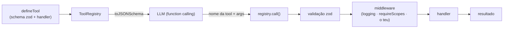

# Arquitetura

O agent-toolbelt é a camada de ferramentas entre o teu modelo e o teu código. Uma tool é
definida uma vez com zod; o registry exporta JSON Schema para o modelo e executa chamadas
validadas através de middleware.

## Mapa de módulos

| Módulo | Responsabilidade |
| --- | --- |
| `tool.ts` | `defineTool` — tool tipada a partir de um schema zod |
| `registry.ts` | Registar, `toJSONSchema()`, `call()` validado + cadeia de middleware |
| `middleware.ts` | `logging`, `requireScopes`, e tipos de erro |

## Princípios de design

- **Uma fonte de verdade** — o schema zod gera os tipos, a validação em runtime e o JSON Schema.
- **Agnóstico de framework** — o `toJSONSchema()` é standard; adapta-o a qualquer SDK. O loop do modelo é teu.
- **Validado antes de executar** — argumentos maus lançam `ToolValidationError`; o handler só vê input válido.
- **Componível** — middleware em cebola para auth, logging, timeouts, etc.
